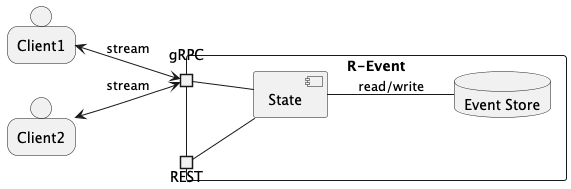
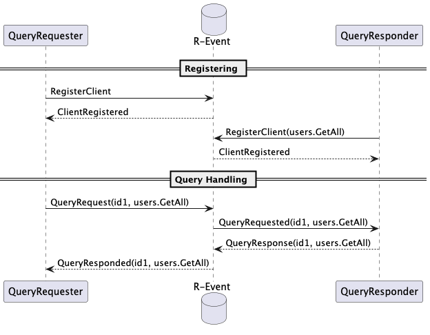
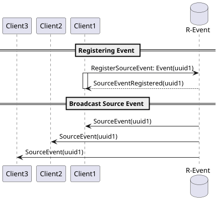

# R-Event

[](https://github.com/manuelarte/revent/actions/workflows/ci.yml)

> [!WARNING]
> R-Event is under heavy development.

**R-Event** is a Rust-based  🦀 gRPC server built around the **[CQRS-ES][CQRS]** pattern.
It is designed to connect distributed clients and route messages between them through clear command/query boundaries.

R-Event focuses on both **query handling** and **source events**: clients can
register capabilities, send requests, receive responses, publish events,
and receive those events broadcast to connected clients through the server.

R-Event is evolving into a full **event store** platform, enabling clients to persist events and build **event-sourced** systems on top of a shared event stream.

[](./.assets/component_diagram.png)

## ⬇️How To Run It

To run R-Event, follow these steps:

```bash
cargo run
```

And then check that the server is running by checking [swagger-ui](http://localhost:10001/swagger).

## 🚀Features

### Query Handlers

A client can send a message to the server, and the server will forward that message to the client that can
 handle that request. The flow is the following:

[](./.assets/query_handler_flow.png)

#### Flow

The typical flow is the following

1. Client sends a message, e.g. `RegisterClient`
2. Server process that client message and triggers a Server Event, e.g. `ClientRegisteredEvent`.
3. Server handle that event, that could potentially trigger a message to the client, e.g. `ClientRegistered`.

### Source Events

A client can produce an event, when the event is received by the server, it will be stored in the event store database
and then broadcasted to all the connected clients.

[](./.assets/new_source_event_flow.png)

## SDK

Currently there is an ongoing sdk to connect Go applications
to R-Event with [revent-sdk-go][revent-sdk-go].

## 📖Glossary

- Client Message: message send from the client to the server.
- Server Message: message send from the server to the client.
- Query Handler: indicates that the client can respond to that query.
- Source Event: event send by the clients that it's going to be stored in the event store.

[CQRS]: https://en.wikipedia.org/wiki/Command_Query_Responsibility_Segregation
[revent-sdk-go]: https://github.com/manuelarte/revent-sdk-go
